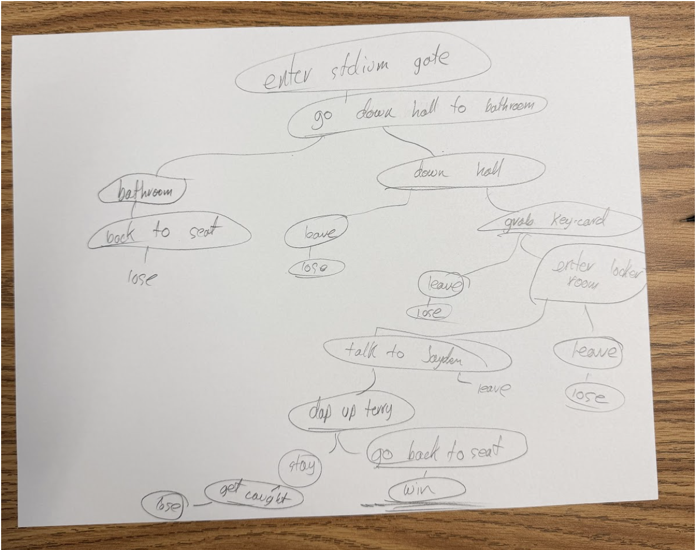

# How to Meet Jayden Daniels

## Setting
This game takes place at Commanders Stadium on game-day. You navigate around the facility to help the commanders win.

## Map

## Story

This game takes place at the Commanders stadium on game-day. You get to the stadium very early and want to go to the bathroom, but, you discover a dark but intriguing hallway. You go down there, grab a left over key card and enter a door that is labelled "locker-room". You go in and find Jayden very nervous. You give him some advice and even say hi to Terry. You then go back in time and watch your team win the game.

## Global Variables

The most important variables are
`haveKeyCard` and `adviceIsGiven`, both
booleans that track progress in the
story. Depending on these two variables,
some rooms will display different things. For example, the door to the
lockeroom will not be able to be opened unless you have the keycard
that you found earlier. The commanders won't win unless adviceIsGiven.

I also have numeric variables called `minute` which keeps track of 
time. `minute` starts at 0 and counts up
with each move.

I have a little HUD map, and use a bunch of 
boolean variables to control which
rooms the player has discovered. A map is only displayed after the user
visits it.
